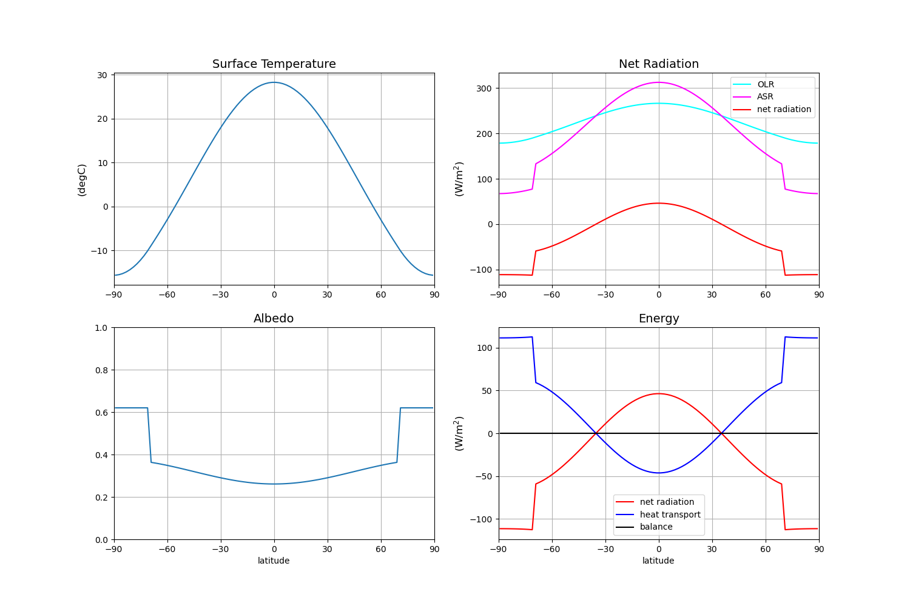

# Climlab Preconfigured Energy Balance Models¶

This model is based on the Climlab [example available here](https://climlab.readthedocs.io/en/latest/courseware/Preconfigured_EBM.html).

## Usage

This model can be run with:

```
python main.py --t0=11.1 --water_depth=12  
```

Additionally, the `timestep` can be set in `parameters.json`.

## Parameters:

* `t0`: initial temperature; default is `12`; units are `°C`
* `water_depth`: water depth; default is `10`; units are `m`
* `timestep`: model timestep; default is `(365.2422 * 24 * 60 * 60 ) / 90`; units are `s`

## Outputs:

This model produces 2 outputs:

1. `ebm_model_results.nc`: netCDF file containing the model output
2. `ebm_results.png`: plot of the model output

 
